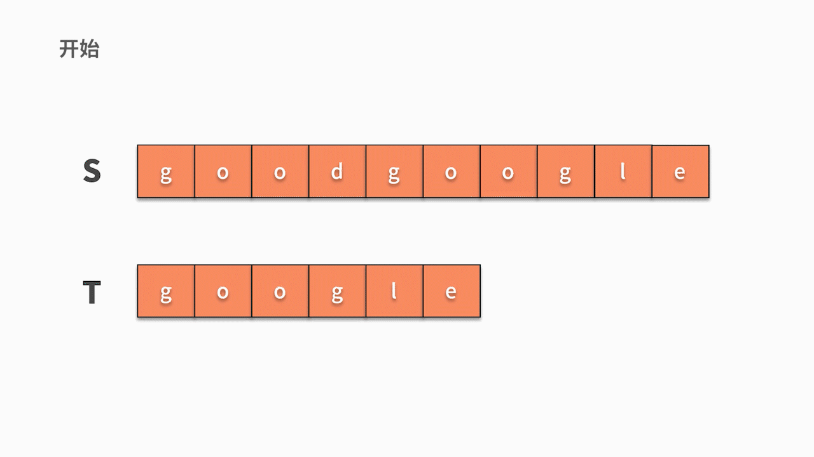

# 重学数据结构与算法

- 第一步，暴力解法。在没有任何时间、空间约束下，完成代码任务的开发。

- 第二步，无效操作处理。将代码中的无效计算、无效存储剔除，降低时间或空间复杂度。
  - 递归、二分法、排序算法、动态规划等常用的算法思维

- 第三步，时空转换。设计合理数据结构，完成时间复杂度向空间复杂度的转移。
  - 数据结构

> 将“昂贵”的时间复杂度转换成“廉价”的空间复杂度

## 线性表

线性表是 n 个数据元素的有限序列

线性表真正的价值在于，它对数据的存储方式是按照顺序的存储。

- 如果数据的元素个数不确定，且需要经常进行数据的新增和删除时，那么链表会比较合适。

- 如果数据元素大小确定，删除插入的操作并不多，那么数组可能更适合些

### 链表

虽然链表在新增和删除数据上有优势，但仔细思考就会发现，这个优势并不实用。这主要是因为，在新增数据时，通常会伴随一个查找的动作

方法

- 链表的翻转
- 快慢指针

## 栈

### 顺序栈

数组

### 链式栈

链表

## 队列

### 顺序队列

依赖数组来实现，其中的数据在内存中也是顺序存储

假溢出

- 不惜消耗 O(n) 的时间复杂度去移动数据；

- 或者开辟足够大的内存空间确保数组不会越界

### 循环队列

当队列为空时，有 front 指针和 rear 指针相等。而现在的队列是满的，同样有 front 指针和 rear 指针相等。那么怎样判断队列到底是空还是满呢？常用的方法是，设置一个标志变量 flag 来区别队列是空还是满

### 链式队列

依赖链表来实现，其中的数据依赖每个结点的指针互联，在内存中并不是顺序存储。链式队列，实际上就是只能尾进头出的线性表的单链表

防止删除最后一个有效数据结点后， front 指针和 rear 指针变成野指针，导致队列没有意义了。有了头结点后，哪怕队列为空，头结点依然存在，能让 front 指针和 rear 指针依然有意义

- 约瑟夫环问题

## 数组

- 链表的长度是可变的，数组的长度是固定的，在申请数组的长度时就已经在内存中开辟了若干个空间

- 链表不会根据有序位置存储，进行插入数据元素时，可以用指针来充分利用内存空间。数组是有序存储的，如果想充分利用内存的空间就只能选择顺序存储，而且需要在不取数据、不删除数据的情况下才能实现

###  字符串

子串查找

## 树和二叉树

二叉树分类

- 满二叉树
- 完全二叉树

遍历方式

- 前序
- 中序
- 后序

### 二叉查找树

## 哈希表

### 如何设计哈希函数

- 直接定制法
- 数字分析法
- 平方取中法
- 折叠法
- 除留余数法

### 如何解决哈希冲突

- 开放定址法
  - 线性探测法
- 链地址法

## 算法思维

降低时间复杂度

### 递归

汉诺塔

### 分治法

可采用分治法的问题的特征

- 难度在降低，即原问题的解决难度，随着数据的规模的缩小而降低。这个特征绝大多数问题都是满足的。

- 问题可分，原问题可以分解为若干个规模较小的同类型问题。这是应用分治法的前提。

- 解可合并，利用所有子问题的解，可合并出原问题的解。这个特征很关键，能否利用分治法完全取决于这个特征。

- 相互独立，各个子问题之间相互独立，某个子问题的求解不会影响到另一个子问题。如果子问题之间不独立，则分治法需要重复地解决公共的子问题，造成效率低下的结果

#### 二分查找

​	必须有序

### 排序

冒泡

插入

归并：空间复杂度为 O(n)

快速：不稳定

### 动态规划

## 方法论

- 复杂度分析。估算问题中复杂度的上限和下限。

- 定位问题。根据问题类型，确定采用何种算法思维。

- 数据操作分析。根据增、删、查和数据顺序关系去选择合适的数据结构，利用空间换取时间。

- 编码实现