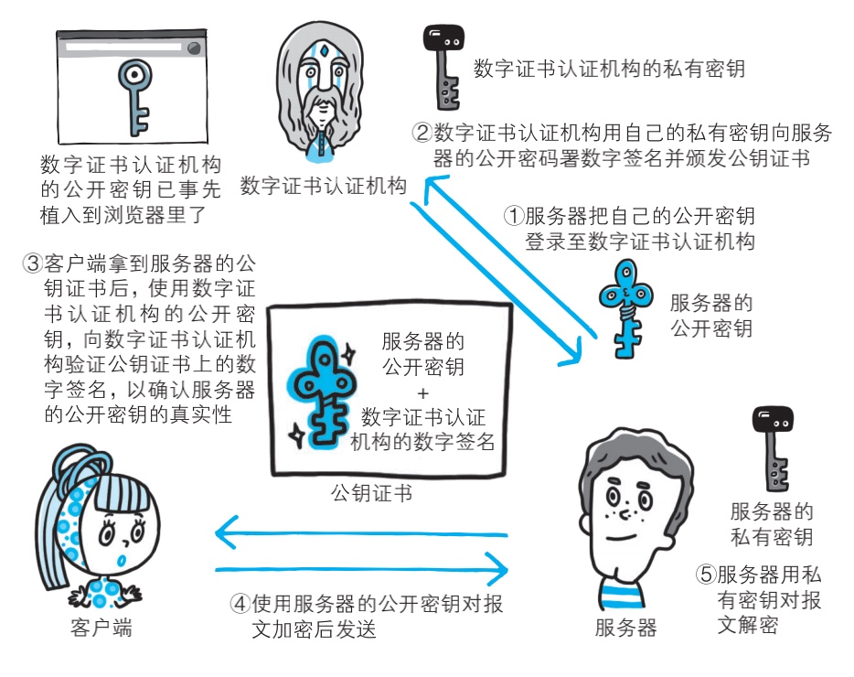

# HTTPS

## HTTP 的问题

- 窃听: 通信使用明文
  - 通信加密: HTTPS
  - 内容加密: body 加密
- 伪装: 没有验证双方身份
  - 客户端, 服务器都可能是伪装的
  - 来着不拒: Dos 攻击
- 篡改: 无法证明报文完整性
  - 请求/响应的内容可能有误: 中间人攻击

## HTTPS

> HTTP + 加密 + 认证 + 完整性保护 = HTTPS

### 如何保证公开秘钥？

1. 浏览器内部植入CA的公钥
2. 服务器向CA提出公钥申请
3. CA的私钥 + 服务器的公钥 = 数字签名
4. 服务器公钥 + 数字签名 = 证书
5. 服务器发送证书给客户端
6. 浏览器用CA的公钥验证证书，得到服务器的公钥
7. 客户端用服务器的公钥加密一个对称加密的秘钥给服务端
8. 后续回话内容都用对称秘钥加解密

## TLS

<http://www.ruanyifeng.com/blog/2014/09/illustration-ssl.html>

<https://blog.csdn.net/summer_fish/article/details/125279853>

<https://medium.com/swlh/understanding-ec-diffie-hellman-9c07be338d4a>

<https://ciphersuite.info/>

TLS_ECDHE_RSA_WITH_AES_128_GCM_SHA256

TLS协议
ECDHE密钥交换算法
RSA签名加密算法 证书里的公钥必须是RSA的公钥
AES_128_GCM AES会话加密算法。用于加密消息流
SHA256  散列算法 消息认证码算法

1. Client Hello（Random，支持的密码套件、压缩方法，tls版本等）
2. Server Hello（Random，确定的密码套件、压缩方法，tls版本等）
3. Certificate
4. Server Key Exchange 发送用于生成pre master secret 的公钥
5. Server Hello Done

Client Key Exchange
Change Cipher Spec
Encrypted Handshake Message
