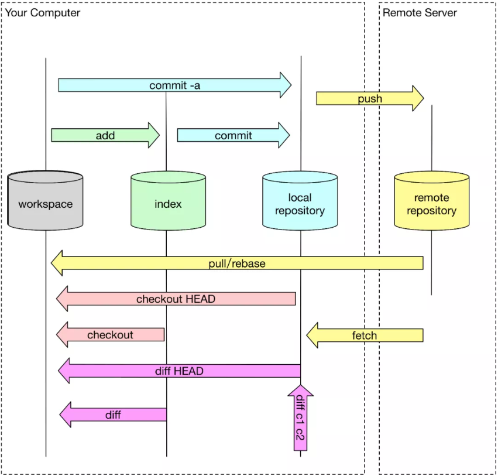

# GIT



## 基本操作

| command                                          | remark                                                  |
| ------------------------------------------------ | ------------------------------------------------------- |
| git clone -b `<branch name>` `<url>`             | 克隆指定分支                                            |
| git add `<file>`                                 | 可反复多次使用，添加多个文件                            |
| git commit                                       | 提交                                                    |
| git status                                       | 工作区的状态                                            |
| git diff                                         | 查看修改内容                                            |
| git reset --hard commit_id                       | 版本恢复，`HEAD`指向的版本就是当前版本                  |
| git checkout -- file                             | 未添加到暂缓区，丢弃工作区的修改                        |
| git log                                          | 查看提交历史                                            |
| git reflog                                       | 查看命令历史，以便确定要回到未来的哪个版本              |
| git rm                                           | 删除                                                    |
| git remote -v                                    | 查看远程库信息                                          |
| **分支**😊                                        |                                                         |
| git branch -a                                    | 查看远程分支                                            |
| git branch                                       | 查看分支                                                |
| git branch `<name>`                              | 创建分支                                                |
| git checkout `<name>`                            | 切换分支                                                |
| git checkout -b `<name>`                         | 创建+切换分支                                           |
| git merge `<name>`                               | 合并某分支到当前分支                                    |
| git branch -d `<name>`                           | 删除分支                                                |
| git log --graph --pretty=oneline --abbrev-commit | 查看分支的合并情况                                      |
| git merge --abort                                | 终止merge                                               |
| git checkout -b branch-name origin/branch-name   | 在本地创建和远程分支对应的分支                          |
| git fetch                                        | 从远程获取最新版本到本地，不会自动merge                 |
| git pull                                         | 更新分支 从远程获取最新版本并merge到本地                |
| git push origin test                             | 把分支推到远程分支                                      |
| **tag**😊                                         |                                                         |
| git tag `<name>`                                 | 用于新建一个标签，默认为 HEAD，也可以指定一个 commit id |
| git tag -a `<tagname>` -m "qaq..."               | 指定标签信息                                            |
| git tag -s `<tagname>` -m "qaq..."               | 用 PGP 签名标签                                         |
| git show `<tagname>`                             | 查看标签详细信息                                        |
| git tag                                          | 可以查看所有标签                                        |
| git push origin `<tagname>`                      | 推送一个本地标签                                        |
| git push origin --tags                           | 推送全部未推送过的本地标签                              |
| git tag -d `<tagname>`                           | 删除一个本地标签                                        |
| git push origin :refs/tags/`<tagname>`           | 删除一个远程标签                                        |
| **other**😊                                       |                                                         |
| ssh-keygen -R github.com                         | 删除known_hosts配置                                     |
| ssh -T <git@github.com>                            | 测试连接                                                |

## no-fast-forward

merge 时生成一个新的 commit，这样，从分支历史上就可以看出分支信息

`git merge --no-ff -m "merge with no-ff" dev`


## 丢弃更改

如果修改未添加到暂缓区，想丢弃工作区的修改：

1. `git checkout -- file`

如果修改已经添加到了暂缓区，想丢弃修改：

1. `git reset HEAD file`
2. `git checkout -- file`

如果修改已经提交到了版本库：

1. `git reset --hard commit_id` 版本回退

## git config

```shell
# 项目配置
git config --local -l
# 用户配置
git config --global -l
# 系统配置
git config --system -l
```

## 关联远程仓库

1.`git remote add origin git@server-name:path/repo-name.git`

2.`git push -u origin master`：第一次推送

3.`git push origin master`：以后的推送

## Stash

暂存工作区和暂存区的修改

1. `git stash`：存储工作现场

2. `git stash pop`：恢复并删除 stash 内容

3. `git stash apply`：恢复工作现场

4. `git stash list`：查看 stash 内容

## 设置代理

ssh

`~/.ssh/config`文件

Socks 代理

mac

```sh
Host github.com
HostName github.com
ProxyCommand nc -v -x 127.0.0.1:1086 %h %p
```

windows

```
Host github.com
  ProxyCommand connect -H 127.0.0.1:10801 %h %p
```

http

指定github.com

```sh
git config --global http.https://github.com.proxy http://127.0.0.1:8080
git config --global https.https://github.com.proxy http://127.0.0.1:8080
```

取消

```sh
git config --global --unset http.proxy
git config --global --unset https.proxy
```

## 查看提交次数

总提交次数：`git log --oneline | wc -l`

某个用户提交次数：`git log --author="用户名" --oneline | wc -l`

每个用户提交次数：`git shortlog -s -n`

某个用户时间范围内提交次数：`git log --author="用户名" --since="2014-07-01" --oneline | wc -l`

## 代码量统计

行数

```sh
git ls-files | xargs cat | wc -l
```

个人代码量：

```sh
git log --author="username" --pretty=tformat: --numstat | awk '{ add += $1; subs += $2; loc += $1 - $2 } END { printf "added lines: %s, removed lines: %s, total lines: %s\n", add, subs, loc }' -
```

每个人代码量

```sh
git log --format='%aN' | sort -u | while read name; do echo -en "$name\t"; git log --author="$name" --pretty=tformat: --numstat | awk '{ add += $1; subs += $2; loc += $1 - $2 } END { printf "added lines: %s, removed lines: %s, total lines: %s\n", add, subs, loc }' -; done
```

## 同步更新fork的仓库

1. 添加一个将被同步给 fork 远程的上游仓库
   - `git remote add upstream https://github.com/apache/flink.git`
2. 从上游仓库 fetch 分支和提交点，传送到本地，并会被存储在一个本地分支 upstream/master
   - `git fetch upstream`
3. 在本地分支上，执行合并
   - `git merge upstream/master`
4. 推送到远程
   - `git push origin master`

## 多账号问题

[一台电脑连接多个 GitHub 账号下的仓库](https://blog.csdn.net/kingsleytong/article/details/70176518)

[Git 如何切换账户](https://blog.csdn.net/junloin/article/details/75197880)

[解决 切换 github 账号后无法 push 的问题](https://www.jianshu.com/p/391a1e591eec)

[Git 最著名报错 “ERROR: Permission to XXX.git denied to user”终极解决方案](https://www.jianshu.com/p/12badb7e6c10)

[Git's famous “ERROR: Permission to .git denied to user”](https://stackoverflow.com/questions/5335197/gits-famous-error-permission-to-git-denied-to-user)

## crlf

```sh
// 拒绝提交包含混合换行符的文件 （一般设置为true）
git config --global core.safecrlf true
// 提交检出均不转换
git config --global core.autocrlf false
```

core.autocrlf
true： 提交时改成LF，检出时改成CRLF
input：提交时改成LF，检出时不改
false：提交时是什么就是什么，不改换行符，检出时也不改   (默认值)

core.safecrlf
true: 拒绝提交包含混合换行符的文件  （会提示 Fatal:xxx）
false: 允许提交包含混合换行符的文件
warn: 提交包含混合换行符的文件时给出警告  (默认值)

## no matching host key type found. Their offer: ssh-rsa

 配置好公私钥之后，仍然无法直接用 git ssh的方式，下载代码，解决：

`.ssh/config`增加以下二项

```
Host x.x.com
  HostKeyAlgorithms ssh-rsa
  PubkeyAcceptedKeyTypes ssh-rsa
```

## fatal: early EOF fatal: fetch-pack: invalid index-pack output

`<https://stackoverflow.com/questions/21277806/fatal-early-eof-fatal-index-pack-failed>`

```sh
# Git 服务器的内存不够了，导致压缩传输数据失败，服务器直接挂了
# 整数 -1..9，表示默认压缩级别。 -1 是 zlib 默认值。0 表示不压缩，9 是最慢的。
# 关闭压缩
git config --global core.compression=0
# 下载最近一次提交
git clone --depth 1 `<repo_URI>`
# 拉取剩余部分
git fetch --unshallow 
# 常规拉取
git pull --all
```

## git flow

<https://nvie.com/posts/a-successful-git-branching-model/>

release 分支理解为 提测分支。来自 develop

如果测试有bug，在release1.2 分支修复，合并回develop，有冲突解决

测试完成要发布了，分别合并回develop 和 master

问题：
1、从master拉分支，分支名：bugfix/xxxxxx   feature/xxxxx
2、开发自测完将新拉分支合到dev，开发环境自测一波
3、开发环境自测没问题，将新拉分支合到test，用test发预发环境
4、测试发现bug/需求调整等，重复2，3步骤
5、测试通过，将此次拉的分支合到master，如需发正式，从master发


## git worktree

```sh
git worktree add <新路径> -b <新分支名>
git worktree add <新路径> -b <新分支名> <指定分支名>
git worktree add ../worktree-fixa -b feature/fixa release
```

从release分支拉一个新分支feature/fixa，放到../worktree-fixa目录

## submodule

<https://git-scm.com/docs/git-submodule>

<https://git-scm.com/docs/gitsubmodules>

添加子模块

```sh
# 会自动拉取代码   .gitmodules添加lodash
git submodule add git@github.com:lodash/lodash.git lodash
```

更新

新clone的项目不会自动clone submodule

```sh
git submodule init 用来初始化本地配置文件，将.gitmodules中关于[submodule]的部分拷贝到.git/config文件中。
git submodule update 根据项目的.gitmodules文件，抓取远程仓库的代码。
```

删除

```sh
# 清空lodash目录（lodash文件夹本身未删除），移除$GIT_DIR/config中的lodash
git submodule deinit lodash
# .gitmodules移除lodash，删除lodash目录，config未修改
git rm lodash

# 手动删除 $GIT_DIR/modules/<name>/
```
