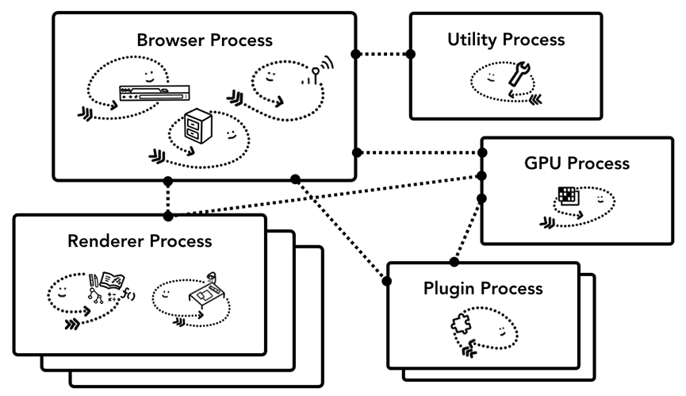
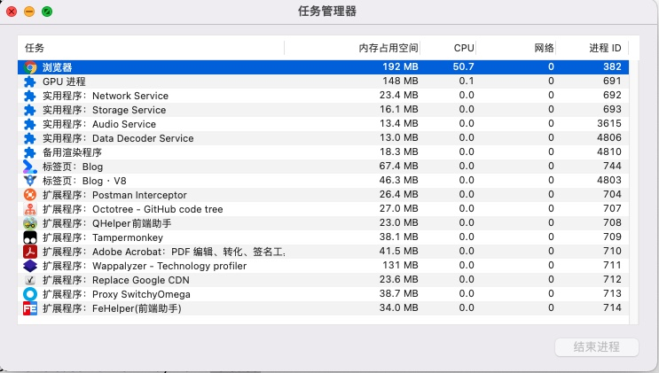

# 深入了解浏览器

## 一、多进程架构图



| 进程     | 说明                                                 |
| -------- | ---------------------------------------------------- |
| Browser  | 地址栏、书签、后退和前进按钮、网络请求和文件访问等   |
| Renderer | 一个选项卡、每个跨站点 iframe 运行单独的渲染器进程   |
| Plugin   | 一个插件一个进程                                     |
| GPU      | 处理来自多个应用程序的请求并将它们绘制在同一个表面上 |

好处

- 当一个选项卡无响应时，不影响其他tab

- 安全性和沙盒

为了节省内存，Chrome 限制了它可以启动的进程数。限制取决于您的设备拥有多少内存和 CPU 能力，但是当 Chrome 达到限制时，它会开始在一个进程中运行来自同一站点的多个选项卡



## 三、渲染器进程

<https://developer.chrome.com/blog/inside-browser-part3/>

渲染器进程的核心工作是将 HTML、CSS 和 JavaScript 转换为用户可以与之交互的网页。

### 解析

#### DOM构建

**主**线程开始**解析**文本字符串 (HTML) 并将其转换为**文档**对象模型( **DOM** )

```js
new DOMParser().parseFromString('<h1>1</h1>',"text/html")
```

::: info

将 HTML 提供给浏览器永远不会引发错误

<https://html.spec.whatwg.org/multipage/parsing.html#an-introduction-to-error-handling-and-strange-cases-in-the-parser>

:::

#### 子资源加载

网站通常使用图像、CSS 和 JavaScript 等外部资源。这些文件需要从网络或缓存中加载。主线程*可以*在解析构建DOM的过程中找到它们时一一请求，但为了加快速度，“预加载扫描器”是并发运行的。如果 HTML 文档中有类似的东西``，`<link>`预加载扫描器会查看 HTML 解析器生成的令牌，并向浏览器进程中的网络线程发送请求


#### JavaScript 阻止解析

当 HTML 解析器找到一个`<script>`标签时，

1. 它会暂停 HTML 文档的解析，

2. 并且必须加载、解析和执行 JavaScript 代码。

为什么？因为 JavaScript 可以使用诸如 document.write() 之类的东西来改变文档的形状

> document.write()会让整个解析重新开始？


#### 优化

- async

- defer
- js 模块
- preload

### 样式计算

主线程解析 CSS 并确定每个 DOM 节点的计算样式。这是关于基于 CSS 选择器将哪种样式应用于每个元素的信息


默认样式

<https://source.chromium.org/chromium/chromium/src/+/main:third_party/blink/renderer/core/html/resources/html.css>

### Layout

形状

x,y,w,h


###  Paint

顺序 z-index


### 成本


- requestAnimationFrame
- web workers

### Compositing

#### 如何绘制页面

rasterizing 光栅化

dom结构 + 样式 + 几何形状位置大小 + 顺序 > 像素

<video autoplay="" controls="" loop="" muted="" playsinline="" src="./images/AiIny83Lk4rTzsM8bxSn.mp4"></video>

- 先绘制视口内的部分
- 如果页面滚动，视口内的内容变化，在通过光栅化补充

#### 什么是合成

- 分为图层，分别光栅化
- 在合成器线程中合成为页面
- 如果发生滚动，合成一个新的帧。 
- 动画可以通过移动图层并合成新帧以相同的方式实现

开发者工具  > 图层

<video autoplay="" controls="" loop="" muted="" playsinline="" src="./images/Aggd8YLFPckZrBjEj74H.mp4"></video>

#### 分层

找出哪些元素需要在哪些层中


- will-change

#### 主线程的光栅与合成


- 合成器线程然后光栅化每一层。一个层可能像一页的整个长度一样大
- 合成器线程将它们分成小块并将每个小块发送到光栅线程
- 光栅线程光栅化每个图块并将它们存储在 GPU 内存中
- 合成器线程可以优先考虑不同的光栅线程，以便可以首先对视口（或附近）内的事物进行光栅化
- 一个图层还具有针对不同分辨率的多个平铺，以处理诸如放大操作之类的事情
- 一旦瓦片被光栅化，合成器线程收集称为**绘制四边形**的瓦片信息以创建**合成器框架**
  - 绘制四边形	考虑到页面合成，包含诸如图块在内存中的位置以及在页面中绘制图块的位置等信息
  - 合成器框架	代表页面框架的绘制四边形集合


- IPC 将合成器框架提交给浏览器进程
-  UI 线程添加另一个合成器框架以更改浏览器 UI
- 如果出现滚动事件，合成器线程会创建另一个合成器帧以发送到 GPU


合成的好处是它是在不涉及主线程的情况下完成的。合成器线程不需要等待样式计算或 JavaScript 执行。这就是为什么[只合成动画](https://www.html5rocks.com/en/tutorials/speed/high-performance-animations/)被认为是流畅性能的最佳选择。如果需要再次计算布局或绘制，则必须涉及主线程
