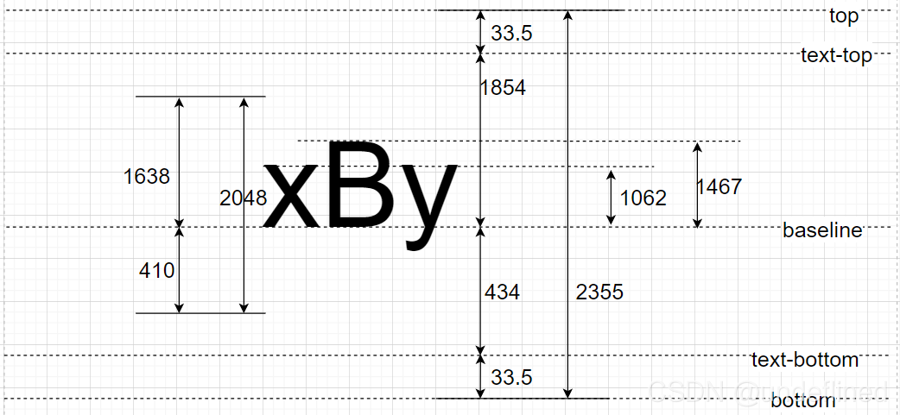

# line-height

两基线的间距

## 基线

- 4线3格的第3条线
- x 的下边缘

vertical-align:middle，middle 指的是基线往上 1/2 x-height 高度，并不是绝对的垂直居中对齐

ex 是 CSS 中的一个相对单位，指的是小写字母 x 的高度，就是 x-height。

内联元素的高度 = 固定高度 + 不固定高度

不固定的部分就是行距

半行距：行距分散在当前文字的上方和下方，上方的半行距不一定等于下方的半行距

- 行距 = 行高 − em-box
- 行距 = line-height - font-size

<https://blog.csdn.net/qq_15601471/article/details/119903856>

Arial 字体为例 2048 对应 font-size 100px 1em的值，也是标准行高

line-height = content-area + 行距 = win上深 + win下深 + 行距

- 上深 1638
- 下深 410
  - 1638 + 410 = 2048

- win上深 1854 text-top 到 baseline

- win下深 434 baseline 到 text-bottom

- 行距 67

  - 上行距：top到text-top

  - 下行距：text-bottom到bottm

  - 图中上行距下行距都为33.5，实际不一定是等分的

- capital Height 1467 大写字母高度
- x-height 1062 小写字母x的高度

- 字形上高 1491 字形达到的最高点
- 字形下深 431 字形达到的最低点

实际计算

line-height = 1638 + 410 + 67 = 2355

100 / 2048 = x / 2355

x = 115

即字体100px时，line-height为115px

capital Height ： 100 / 2048 *1467= 71.630859375 ≈ 72px
x的高度就是 100 / 2048* 1106 = 51.85546875 ≈ 52px，这也是1ex的值（ex可以用来做居中对齐，真居中对齐）；
线距 100 / 2048 * 67 = 3.271484375 ≈ 3
