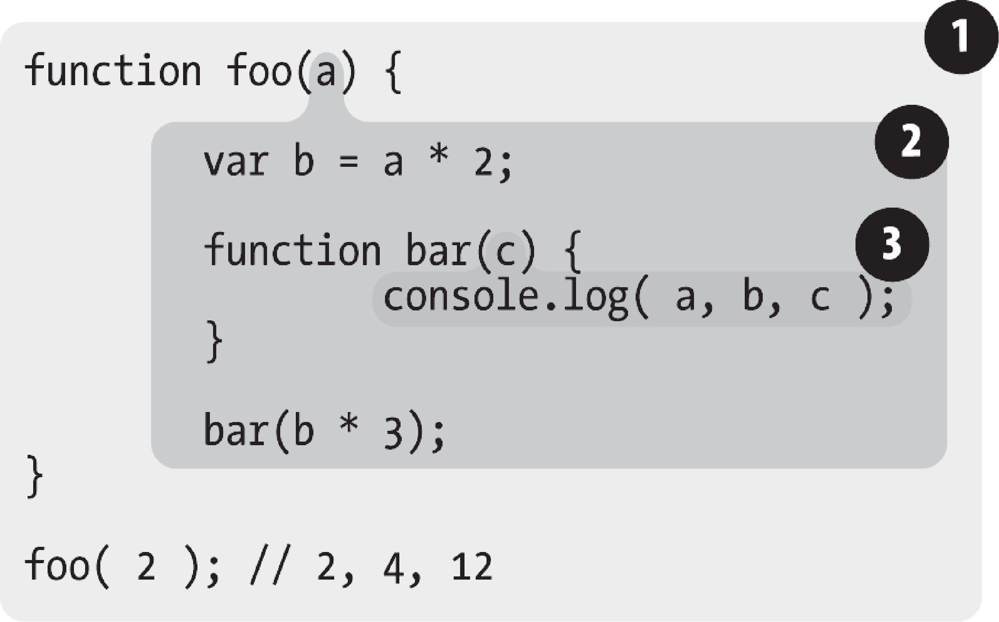

# 作用域

根据名称查找变量的一套规则

## 作用域链

从当前的执行作用域开始查找变量，如果找不到，就向上一级继续查找。当抵达最外层的全局作用域时，无论找到还是没找到，查找过程都会停止

## LHS & RHS

```js
var a = b;
```

LHS查询

- 容器查找、变了地址查找、一般在等号左边
- 赋值操作的目标是谁
- 如果查找的目的是对变量进行赋值，那么就会使用 LHS 查询

RHS查询

- 值的引用、一般在等号右边
- 谁是赋值操作的源头
- 如果目的是获取变量的值，就会使用 RHS 查询

```js
function foo(a) {
  var b = a;
  return a + b;
}
var c = foo( 2 ); 
// 1. 找出所有的 LHS 查询（这里有 3 处！） c = ..;、a = 2（隐式变量分配）、b = .. 
// 2. 找出所有的 RHS 查询（这里有 4 处！）foo(2..、= a;、a ..、.. b
```

### 有什么用？ - 异常

如果 RHS 查询在所有嵌套的作用域中遍寻不到所需的变量，引擎就会抛出 ReferenceError 异常

```js
function foo(a) {
  console.log(a + b)
  b = a
}
foo(2)
```

执行 LHS 查询时，如果在顶层（全局作用域）中也无法找到目标变量， 全局作用域中就会创建一个具有该名称的变量，并将其返还给引擎，前提是程序运行在非 “严格模式”下。

```js
function foo(a) { 
  b = a; 
}
foo(2);
console.log(b)
```

严格模式

```js
function foo(a) {
  'use strict'
  b = a
}
foo(2)
console.log(b)
```

<https://stackoverflow.com/questions/11677452/possible-to-enable-strict-mode-in-firebug-and-chromes-console>

解决：

- 一行
- 页面

```js
function foo(a) {'use strict'; b = a } foo(2); console.log(b);
```

如果 RHS 查询找到了一个变量，但是你尝试对这个变量的值进行不合理的操作， 比如试图对一个非函数类型的值进行函数调用，或着引用 null 或 undefined 类型的值中的 属性，那么引擎会抛出另外一种类型的异常，叫作 TypeError

```js
function foo(a) {
  a()
}
foo(2)
```

### 总结

ReferenceError：The ReferenceError object represents an error when a variable that doesn't exist (or hasn't yet been initialized) in the current scope is referenced.

- ReferenceError 同作用域判别失败相关
- TypeError 则代表作用域判别成功了，但是对结果的操作是非法或不合理的

哪里出现过：The directive does not have the attribute value which is valid as LHS.

## 词法作用域

静态的

词法作用域就是定义在词法阶段的作用域,换句话说，词法作用域是由你在写代码时将变量和块作用域写在哪里来决定的，因此当词法分析器处理代码时会保持作用域不变（大部分情况下是这样的）



- 包含着整个全局作用域，其中只有一个标识符：foo
- 包含着 foo 所创建的作用域，其中有三个标识符：a、bar 和 b
- 包含着 bar 所创建的作用域，其中只有一个标识符

### 例外情况

#### eval

```js
var b = 2
function foo(str, a) {
  eval(str) // 欺骗！
  console.log(a, b)
}
foo('var b = 3;', 1) // 1, 3

```

```js
var b = 2
function foo(str, a) {
  // eval(str) // 欺骗！
  {
    let b = 6
  }
  console.log(a, b)
}
foo('let b = 3;', 1) // 1, 2
```

eval引入了新的代码块

#### with

```js
function f(a, b) {
  with (b) {
    console.log(a)
  }
}
//先在指定的对象中查找
f(1, { a: 2 }) //2
f(1, 2) //1
```

哪里用到with

```js
const app = new Vue({
  el: '#app',
  data: {
    count: 999,
  },
})
console.log(app.$options.render)
// function anonymous() {
//   with (this) {
//     return _c('div', { attrs: { id: 'app' } }, [_v('\n      ' + _s(count) + '\n      '), _c('span', [_v(' ' + _s(count + 1) + ' '])])
//   }
// }
// _c:h
// _v:创建文本节点
```

**利：**`with`语句可以在不造成性能损失的情況下，减少变量的长度。其造成的附加计算量很少。使用'with'可以减少不必要的指针路径解析运算。需要注意的是，很多情況下，也可以不使用 with 语句，而是使用一个临时变量来保存指针，来达到同样的效果。

**弊：**`with`语句使得程序在查找变量值时，都是先在指定的对象中查找。所以那些本来不是这个对象的属性的变量，查找起来将会很慢。如果是在对性能要求较高的场合，'with'下面的 statement 语句中的变量，只应该包含这个指定对象的属性

> 推荐的替代方案是声明一个临时变量来承载你所需要的属性

## 函数作用域

用var声明的变量，自动提升到函数作用域顶部

属于这个函数的全部变量都可以在整个函数的范围内使用及复 用（事实上在嵌套的作用域中也可以使用）。这种设计方案是非常有用的，能充分利用 JavaScript 变量可以根据需要改变值类型的“动态”特性。

- 参数作用域

```js
function fun(x, f) {
  // debugger
  var x;
  var y = x;
  f = () => x
  x = 2;
  console.log(x, y, f())
}
fun(1)
```

```js
var x // 没有右值，只有静态语音，没有运行时语义
var x = undefined // 都有
```

```js
function fun(x, f = () => x) {
  var x;
  var y = x;
  x = 2;
  console.log(x, y, f())
}
fun(1)
```

- 两层作用域，参数作用域的x,函数作用域的x
- 函数作用域的x初始值复制外层(参数作用域)的x

```js
function fun(x, f = () => x) {
  // var x;
  var y = 'a';
  x = 2;
  z = 'z'
  console.log(x, y, f())
}
fun(1)
```

x 在 参数作用域找到了，不会挂到window

- IIFE

## 块级作用域

代码块{}

使用const,let声明的变量，范围是块级作用域

for

```js
if (true) {
  let a = 1
}
console.log(a)
```

- with
- catch

```js
try {
  console.log(a)
} catch (e) {
  console.log('catch', e)
}
console.log('out', e)
```

## hoisting

```js
console.log(a)
//...
var a = 1
```

```js
var a;
console.log(a)
//...
a = 1
```

let 提升吗

```js
console.log(a)
let a;
```

### 总结

1. let 的「声明」过程被提升了，但是初始化没有提升。
2. var 的「声明」和「初始化」都被提升了。
3. function 的「创建」「初始化」和「赋值」都被提升了。

## 执行上下文

this + scope
动态的调用者 + 静态的被调用者

- 全局代码— 首次执行代码的默认环境。
- 函数代码——每当执行流程进入函数体时。
- eval 代码- 要在内部 eval 函数中执行的文本。

### this 的指向

> this 的值是在执行的时候才能确认，定义的时候不能确认

#### 直接调用

this 指向 window

```javascript
function foo() {
  console.log(this.a) //1
}
var a = 1
foo()
```

#### 间接调用

谁调用了函数，谁就是 this

```javascript
function fn() {
  console.log(this)
}
var obj = {
  fn: fn,
}
obj.fn() //this->obj
```

#### 类的实例

在构造函数模式中，类中(函数体中)出现的 this.xxx=xxx 中的 this 是当前类的一个实例

```javascript
function CreateJsPerson(name, age) {
  //this是当前类的一个实例p1
  this.name = name //=>p1.name=name
  this.age = age //=>p1.age=age
}
var p1 = new CreateJsPerson('abc', 48)
```

#### 箭头函数

箭头函数没有自己的 this，看其外层的是否有函数，如果有，外层函数的 this 就是内部箭头函数的 this，如果没有，则 this 是 window

```javascript
let btn1 = document.getElementById('btn1')
let obj = {
  name: 'kobe',
  age: 39,
  getName: function() {
    btn1.onclick = () => {
      console.log(this) //obj
    }
  },
}
obj.getName()
```

#### 改变作用域

call、apply 和 bind：this 是第一个参数

```javascript
function add(c, d) {
  console.log(this.a + this.b + c + d)
}
var a = 10
var b = 20
var o = {
  a: 1,
  b: 3,
}
add(30, 40) // 10 + 20 + 30 + 40 = 100
add.call(o, 5, 7) // 1 + 3 + 5 + 7 = 16
add.apply(o, [10, 20]) // 1 + 3 + 10 + 20 = 34
add.bind(o)(1, 2) // 1 + 3 + 1 + 2 = 7
```

(0, function)(param)

逗号运算符，对它的每个操作数求值（从左到右），并返回最后一个操作数的值
<https://developer.mozilla.org/en-US/docs/Web/JavaScript/Reference/Operators/Comma_Operator>

```javascript
const obj = {
 fun: function () {
  return this;
 },
};
console.log(1, obj.fun());
console.log(2, (0, obj.fun)());
```

`(0, obj.fun)()` 等价与  `fun = obj.fun; fun()`

#### 寻找 this


## 最佳实践

- 不使用var，const优先，let次之
- 避免this
