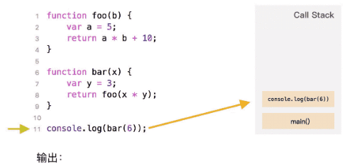

# Execution Contexts

**可以把执行上下文栈认为是一个存储函数调用的栈结构，遵循先进后出的原则**

\*\*
\*\*

- JavaScript 执行在单线程上，所有的代码都是排队执行。
- 一开始浏览器执行全局的代码时，首先创建全局的执行上下文，压入执行栈的顶部。

- 每当进入一个函数的执行就会创建函数的执行上下文，并且把它压入执行栈的顶部。当前函数执行完成后，当前函数的执行上下文出栈，并等待垃圾回收。
- 浏览器的 JS 执行引擎总是访问栈顶的执行上下文。

- 全局上下文只有唯一的一个，它在浏览器关闭时出栈

例子：

```javascript
var color = 'blue'
function changeColor() {
  var anotherColor = 'red'
  function swapColors() {
    var tempColor = anotherColor
    anotherColor = color
    color = tempColor
  }
  swapColors()
}
changeColor()
```

- 当上述代码在浏览器中加载时，JavaScript 引擎会创建一个全局执行上下文并且将它推入当前的执行栈
- 调用 changeColor 函数时，此时 changeColor 函数内部代码还未执行，js 执行引擎立即创建一个 changeColor 的执行上下文（简称 EC），然后把这执行上下文压入到执行栈（简称 ECStack）中。

- 执行 changeColor 函数过程中，调用 swapColors 函数，同样地，swapColors 函数执行之前也创建了一个 swapColors 的执行上下文，并压入到执行栈中。
- swapColors 函数执行完成，swapColors 函数的执行上下文出栈，并且被销毁。

- changeColor 函数执行完成，changeColor 函数的执行上下文出栈，并且被销毁


参考：

<https://blog.fundebug.com/2019/03/20/understand-javascript-context-and-stack/>
