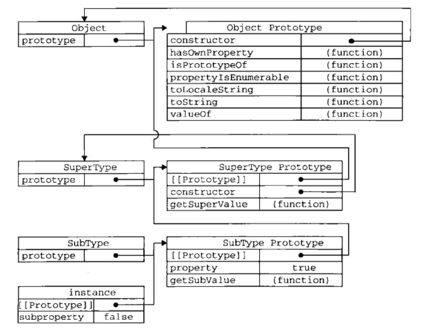
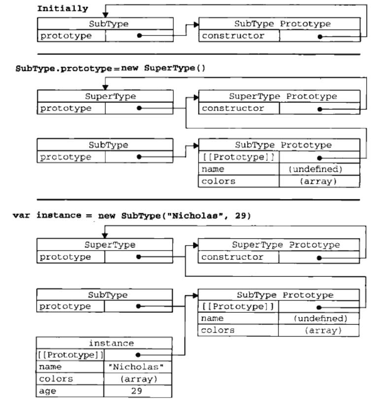

# sh

## type

| type      | ToObject() | valueOf() |      |      |
| --------- | ---------- | --------- | ---- | ---- |
| Undefined |            | -         |      |      |
| Null      |            | -         |      |      |
| Boolean   |            | 布尔值    |      |      |
| Number    |            | 数字值    |      |      |
| String    |            | 字符串值  |      |      |
| Symbol    |            |           |      |      |
| BigInt    |            |           |      |      |
| Object    |            |           |      |      |
|           |            |           |      |      |

Boolean、Number、String哪里用到

vue props

undefined null区别

什么时候用null

*Object*.create(null);

Object.prototype.__proto__

## 一、类型

- 零舍一入
- 除零取整法
- 乘零取整法

### Map,WeakMap

> WeakMap：其中的键是弱引用的。其键必须是对象，而值可以是任意的

`node --expose-gc server.js`

```js
global.gc()
console.log('start:heapUsed', process.memoryUsage().heapUsed)

let key = new Array(5 * 1024 * 1024).fill(1)
console.log('array:heapUsed', process.memoryUsage().heapUsed)
const map = new Map()

map.set(key, 1)
global.gc()
console.log('map  :heapUsed', process.memoryUsage().heapUsed)

key = null
global.gc()
console.log('null :heapUsed', process.memoryUsage().heapUsed)
```


### 应用

### ieee 7

$$
\begin{aligned}
& 12.34 = 1 \times 10^1 + 2 \times 10^0 + 3 \times 10^{-1} + 4 \times 10^{-2} \\
& 7.75 = 4 + 2 + 1 + 1 / 2 + 1 / 4 = 1 \times 2^2 + 1 \times 2^1 + 1 \times 2^0 + 1 \times 2^{-1} + 1 \times 2^{-2} = 111.11_2
\end{aligned}
$$

- 对于十进制，小数点的左移右移相当于乘以10或除以10
- 对于二进制，小数点的左移右移相当于乘以2或除以2

科学计数法

- 节省内存空间
- 直观的确定大小

---

二进制科学计数法

$$ {aligned}
\alpha \times 2^n
$$

- 指数基数为2
- $\mid a \mid >= 1 且 \mid a \mid < 2$
- n为整数

$$
7.75 = 111.11_2 = 1.1111 \times 2^2
$$

### IEEE 754定义

<https://zh.wikipedia.org/zh-hans/IEEE_754>


- sign：0表示正数，1表示负数
- exponent： 指数值加上一个偏移值，偏移值为：$2^{n-1}-1$，其中的n为存储指数的比特位长度
- fraction：小数部分（最高位1规定不显示存储）

32位单精度

- 1位符号位，8位指数位，23位小数位；偏移值127
- $n=(-1)^{sign} \times (1+小数) \times 2^{指数-127}$

#### 举例

$$
\begin{align}
78 &= 1 \times 2^6 +  0 \times 2^5 + 0 \times 2^4 + 1 \times 2^3 + 1 \times 2^2 +  1 \times 2^1 +  0 \times 2^0 \\
&= 1001110_2 \\
&= 1.001110_2 \times 2^6
\end{align}
$$

- sign为0，exponent为6+127=133=$10000101_2$，fraction为001110

- 0-10000101-00111000000000000000000

$$
-16 = -10000_2 = -1.0000 \times 2^4
$$

- sign为1，exponent为$4+127=131=10000011_2$，fraction为0000

- 1-10000011-00000000000000000000000

$$
7.75 = 111.11_2 = 1.1111 \times 2^2
$$

- sign为0，exponent为$2+127=129=10000001_2$，fraction为0000

- 0-10000001-11110000000000000000000

还原

#### 0.1+0.2


$0.1 = (0.0\dot0\dot0\dot1\dot1)_2=(-1)^0\times2^{-4}\times(1.\dot1\dot0\dot0\dot1)_2$

- sign为0，exponent为$-4+127=123=01111011_2$，fraction为0000

- 0-01111011-10011001100110011001101

$0.2 = 0.1\times2^1=(-1)^0\times2^{-3}\times(1.\dot1\dot0\dot0\dot1)_2$

- sign为0，exponent为$-3+127=124= 01111100_2$，fraction为0000

- 0-01111100-10011001100110011001101

先进行“对位”，将较小的指数化为较大的指数，并将小数部分相应右移
$$
\begin{align}
0.1 &= (-1)^0\times2^{-3}\times(0.1100 1100 1100 1100 1100 110)_2 \\
0.2 &= (-1)^0\times2^{-3}\times(1.1001 1001 1001 1001 1001 101)_2 \\
0.1 + 0.2 &=(-1)^0\times2^{-3}\times(10.0110 0110 0110 0110 0110 011)_2 \\
&= (-1)^0\times2^{-2}\times(1.0011 0011 0011 0011 0011 010)_2 \\
\end{align}
$$

```js
// 0.3
// 0.010011001100110011001100110011001100110011001100110011
// 0.0100110011001100110011001100110011001100110011001101
const str = '0.0100110011001100110011001100110011001100110011001101',
  len = str.length
let e = 0,
  expression = ''
for (let i = 0; i < len; i++) {
  const element = str[i]
  if (element === '.') {
    continue
  }
  expression += element + ' * 2  ' + e-- + (i === len - 1 ? '' : ' + ')
}
console.log(expression)
console.log(eval(expression))
```

#### reference

<https://segmentfault.com/a/1190000008268668>

<https://babbage.cs.qc.cuny.edu/IEEE-754/>

<https://devtool.tech/double-type>

## 解决方案

<https://github.com/josdejong/mathjs>

<https://github.com/nefe/number-precision>

## 确定 this 的指向


## 面向对象的程序设计-继承

基础的实现主要依靠原型链来实现

## 原型链

原型链做为实现继承的主要方法。

构造函数，原型，实例之间的关系：每个构造函数都有一个原型对象，原型对象都包含一个指向构造函数的指针，而实例都包含一个指向原型对象的内部指针。

```js
function SuperType(){
  this.property = true;
}

SuperType.prototype.getSuperValue = function(){
  return this.property;
};

function SubType(){
  this.subproperty = false;
}

//继承了SuperType
SubType.prototype = new SuperType();
SubType.prototype.getSubValue = function (){
  return this.subproperty;
};

var instance = new SubType();
console.log(instance.getSuperValue());  //true
```


调用getSuperValue方法会经历三个步骤：

1. 搜索实例
2. 搜索SubType.Prototype
3. 搜索SupperType.Prototype

### 默认原型

所有函数的默认原型都是Object的实例，因此默认原型都会包含一个内部指针，指向Object.Prototype。



### 确定原型和实例的关系

```js
alert(instance instanceof Object);    //true
alert(instance instanceof SuperType);  //true
alert(instance instanceof SubType);   //true

alert(Object.prototype.isPrototypeOf(instance));   //true
alert(SuperType.prototype.isPrototypeOf(instance)); //true
alert(SubType.prototype.isPrototypeOf(instance));  //true
```

### 谨慎的定义方法

给原型添加方法的代码一定要放在替换原型的语句之后。

```js
function SuperType(){
  this.property = true;
}

SuperType.prototype.getSuperValue = function(){
  return this.property;
};

function SubType(){
  this.subproperty = false;
}

//继承了SuperType
SubType.prototype = new SuperType();

//添加新方法
SubType.prototype.getSubValue = function () {
  return this.subproperty
}
//重写超类型中的方法
SubType.prototype.getSuperValue = function (){
  return false;
};

var instance = new SubType();
console.log(instance.getSuperValue());  //false

```

> 通过原型链实现继承时，不是使用对象字面量创建原型方法，因为这样就会重写原型链。

```js
function SuperType() {
  this.property = true
}
SuperType.prototype.getSuperValue = function () {
  return this.property
}
function SubType() {
  this.subproperty = false
}
//继承了SuperType
SubType.prototype = new SuperType()
//使用字面量添加新方法，会导致上一行代码无效
SubType.prototype = {
  getSubValue: function () {
    ​return this.subproperty
  },
  someOtherMethod: function () {
    return false
  },
}
var instance = new SubType()
console.log(instance.getSuperValue()) //error!
```

### 4.原型链的问题

#### 1.引用类型的问题

```js
function SuperType() {
  this.colors = ['red', 'blue', 'green']
}
function SubType() {}
//继承了 SuperType
SubType.prototype = new SuperType()
var instance1 = new SubType()
instance1.colors.push('black')
console.log(instance1.colors) //"red,blue,green,black"
var instance2 = new SubType()
console.log(instance2.colors) //"red,blue,green,black"
```

#### 2.传参问题

在创建子类实例是，不能向超类型的构造函数中传递参数。

## 借用构造函数

函数只不过是特定环境中执行代码的对象，因为通过使用apply()和call()方法也可以在（将来）新创建的对象上执行构造函数

```js
function SuperType() {
  this.colors = ['red', 'blue', 'green']
}
function SubType() {
  //继承了 SuperType
  SuperType.call(this)
}
var instance1 = new SubType()
instance1.colors.push('black')
console.log(instance1.colors) //"red,blue,green,black"
var instance2 = new SubType()
console.log(instance2.colors) //"red,blue,green"
```

### 1.传递参数

```js
function SuperType(name) {
  this.name = name
}
function SubType(name) {
  //继承了 SuperType 同时还传递了参数
  SuperType.call(this, name)
  //实例属性
  this.age = 29
}
var instance = new SubType('Nicholas')
console.log(instance.name) //"Nicholas";
console.log(instance.age) //29
```

### 2.借用构造函数的问题

方法都在构造函数中定义，函数无法复用。

## 组合继承

将原型链和借用构造函数的方式组合在一起,这样，同在原型上定义方法实现了函数复用，又能保证每个实例都有它自己的属性。

```js
function SuperType(name) {
  this.name = name
  this.colors = ['red', 'blue', 'green']
}

SuperType.prototype.sayName = function () {
  console.log(this.name)
}

function SubType(name, age) {
  //继承属性
  SuperType.call(this, name)
  this.age = age
}

//继承方法
SubType.prototype = new SuperType()

SubType.prototype.sayAge = function () {
  console.log(this.age)
}

var instance1 = new SubType('Nicholas', 29)
instance1.colors.push('black')
console.log(instance1.colors) //"red,blue,green,black"
instance1.sayName() //"Nicholas";
instance1.sayAge() //29
var instance2 = new SubType('Greg', 27)
console.log(instance2.colors) //"red,blue,green"
instance2.sayName() //"Greg";
instance2.sayAge() //27
```

> 组合继承是最常用的继承模式

### 存在问题

无论什么情况下，都会调用两次超类型构造函数，一次是在创建子类型原型的时候，另一次是在子类型构造函数内部。子类型包含父类型对象的全部实例属性，但不得不在调用子类型构造函数时重写这些属性。

```js
function SuperType(name) {
  this.name = name
  this.colors = ['red', 'blue', 'green']
  console.log('super constructor called')
}
SuperType.prototype.sayName = function () {
  console.log(this.name)
}
function SubType(name, age) {
  SuperType.call(this, name) //第二次调用SuperType()
  this.age = age
}
SubType.prototype = new SuperType() //第一次调用SuperType()
// SubType.prototype.constructor = SubType
SubType.prototype.sayAge = function () {
  console.log(this.age)
}
const subtype = new SubType('tom', 20)
console.log(subtype.name)
console.log(subtype.colors)
console.log(subtype.age)
subtype.sayName()
subtype.sayAge()
```

- 第一次调用：SubType.prototype获得name和colors属性，来自SuperType的实例属性，位于SubType的原型中

- 第二次调用：在新对象上创建了实例属性name和colors，屏蔽了原型中的同名属性



## 原型式继承

这种方法没有严格意义上的构造函数，借助原型可以基于已有的对象创建新对象，同时还不必因此创建自定义类型。

```js
function object(o) {
  function F() {}
  F.prototype = o
  return new F()
}
var person = {
  name: 'Nicholas',
  friends: ['Shelby', 'Court', 'Van'],
}
var anotherPerson = object(person)
anotherPerson.name = 'Greg'
anotherPerson.friends.push('Rob')
var yetAnotherPerson = object(person)
yetAnotherPerson.name = 'Linda'
yetAnotherPerson.friends.push('Barbie')
console.log(person.friends) //"Shelby,Court,Van,Rob,Barbie"
```

在object()函数内部，先创建一个临时构造函数，然后将传入的对象作为这个构造函数的原型，最后返回了这个临时类型的新实例。

- 不明确类型
- 引用类型被修改

### Object.create()

ES5中新增Object.create()方法规范化了原型式继承。

参数：一个用作新对象原型的对象和一个新对象定义额外属性的对象

```js
var person = {
  name: 'Nicholas',
  friends: ['Shelby', 'Court', 'Van'],
}
var anotherPerson = Object.create(person)
anotherPerson.name = 'Greg'
anotherPerson.friends.push('Rob')
var yetAnotherPerson = Object.create(person)
yetAnotherPerson.name = 'Linda'
yetAnotherPerson.friends.push('Barbie')
console.log(person.friends) //"Shelby,Court,Van,Rob,Barbie"
```

Object.create()方法的第二个参数与Object.defineProperties()的第二参数格式相同,如果该参数被指定且不为 undefined，该传入对象的自有可枚举属性(即其自身定义的属性，而不是其原型链上的枚举属性)将为新创建的对象添加指定的属性值和对应的属性描述符

```js
var person = { name: 'Nicholas', friends: ['Shelby', 'Court', 'Van'] }
var anotherPerson = Object.create(person, { name: { value: 'Greg' } })
console.log(person.name) //"Nicholas"
console.log(anotherPerson.name) //"Greg"
```

## 寄生式继承

创建一个仅用于封装继承过程的函数，该函数在内部以某种方式来增强对象，最后再像真地是它做了所有工作一样返回对象。

```js
function object(o) {
  function F() {}
  F.prototype = o
  return new F()
}
function createAnother(o) {
  //通过调用函数创建一个新对象
  var clone = object(o)
  //以某种方式增强这个对象
  o.sayHi = function () {
    console.log('hi')
  }
  //返回这个对象
  return o
}
//使用
var person = {
  name: 'Nicholas',
  friends: ['Shelby', 'Court', 'Van'],
}
var anotherPerson = createAnother(person)
anotherPerson.sayHi() //"hi"
```

> 这种方式做不到函数复用而降低效率，类似构造函数模式

## 寄生式组合继承

借用构造函数来继承属性，通过原型链的混成形式来继承方法。

基本思路：不必为了指定子类型的原型而调用父类型的构造函数。

```js
function inheritPrototype(subType, superType) {
  subType.prototype = Object.create(superType.prototype) //创建对象,指定对象
  subType.prototype.constructor = subType //增强对象
}
```

inheritPrototype()函数接收两个参数：子类型构造函数和父类型构造函数。

在函数内部：

1. 创建父类型原型的副本

2. 为创建副本添加constructor属性，从而弥补因重写原型失去默认的constructor属性

3. 将新创建的对象（即副本）赋值给予子类型的原型

```js
function inheritPrototype(subType, superType) {
  subType.prototype = Object.create(superType.prototype) //创建对象,指定对象
  subType.prototype.constructor = subType //增强对象
}
function SuperType(name) {
  this.name = name
  this.colors = ['red', 'blue', 'green']
}
SuperType.prototype.sayName = function () {
  console.log(this.name)
}
function SubType(name, age) {
  SuperType.call(this, name)
  this.age = age
}
inheritPrototype(SubType, SuperType)
SubType.prototype.sayAge = function () {
  console.log(this.age)
}
var instance1 = new SubType('Nicholas', 29)
instance1.colors.push('black')
console.log(instance1.colors) //"red,blue,green,black"
instance1.sayName() //"Nicholas";
instance1.sayAge() //29
var instance2 = new SubType('Greg', 27)
console.log(instance2.colors) //"red,blue,green"
instance2.sayName() //"Greg";
instance2.sayAge() //27
```

这个例子高效体现了它只调用了一次SuperType构造函数，避免了在SubType.prototype上创建不必要的、多余的属性。原型链还能保持不变。

> 寄生组合继承是引用类型最理想的继承范式

Vue.extend()方法采用了寄生组合继承模式。
<https://github.com/vuejs/vue/blob/dev/src/core/global-api/extend.js#L36-L37>
