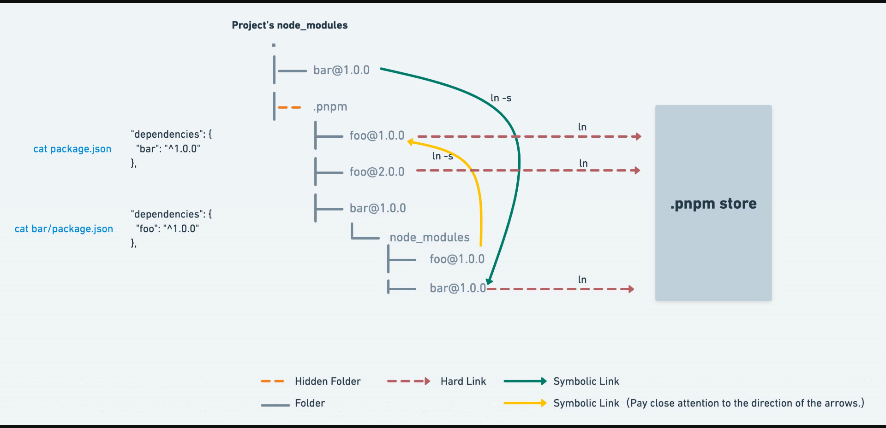

# pnpm

*npm@3*之前采用非扁平化

```
node_modules
└─ foo
   ├─ index.js
   ├─ package.json
   └─ node_modules
      └─ bar
         ├─ index.js
         └─ package.json
```

问题：

- 包经常创建太深的依赖树，这会导致 Windows 上出现长目录路径问题
- 包在不同的依赖项中需要时被多次复制粘贴

*npm@3*之后采用扁平化

```
node_modules
├─ foo
|  ├─ index.js
|  └─ package.json
└─ bar
   ├─ index.js
   └─ package.json
```

问题：

1. 模块可以访问它们不依赖的包
2. 扁平化依赖树的算法非常复杂
3. 一些包必须复制到一个项目的*node_modules*文件夹中

pnpm 试图解决npm@3之前的问题，而不会使依赖关系树变平

`npm add express`

```
.bin
accepts
array-flatten
body-parser
bytes
content-disposition
cookie-signature
cookie
debug
depd
destroy
ee-first
encodeurl
escape-html
etag
express
```

`pnpm add express`

```
.pnpm
.modules.yaml
express
```

`express` 的依赖不在 `.pnpm/express@4.17.1/node_modules/express/node_modules/` 而是在 `.pnpm/express@4.17.1/node_modules/`

`express` 所有的依赖都软链至了 `node_modules/.pnpm/` 中的对应目录。 把 `express` 的依赖放置在同一级别避免了循环的软链

pnpm更多特性：

1. **安全。**与Yarn 一样，pnpm 有一个特殊文件，其中包含所有已安装包的校验和，以在执行每个已安装包的代码之前验证其完整性。
2. **离线模式。**pnpm 将所有下载的包 tarball 保存在本地注册表镜像中。当包在本地可用时，它从不发出请求。使用该`--offline`参数，可以完全禁止 HTTP 请求。
3. **速度。**pnpm 不仅比 npm 快，而且比 Yarn 快。无论是冷缓存还是热缓存，它都比 Yarn 快。Yarn 从缓存中复制文件，而 pnpm 只是从全局存储中链接它们

幽灵依赖问题：只有直接依赖会平铺在 node_modules 下，子依赖不会被提升，不会产生幽灵依赖。
依赖分身问题：相同的依赖只会在全局 store 中安装一次。项目中的都是源文件的副本，几乎不占用任何空间，没有了依赖分身。
最大的优点是节省磁盘空间，一个包全局只保存一份，剩下的都是软硬连接

## deep



package.json

```json
{
  "dependencies": {
    "dayjs": "^1.11.9",
    "element-plus": "^2.3.8",
    "vue": "^3.3.4"
  }
}
```

软链接

```sh
# git bash
ls -li
readlink antd
```

第三列数字就是硬链接的数量


`dayjs` `element-plus` `vue` 为软连接

结合文件资源管理看


`dayjs` `element-plus` `vue` 为快捷方式

`dayjs`实际指向`/mnt/c/Users/Administrator/Desktop/pnpm-demo/node_modules/.pnpm/registry.npmmirror.com+dayjs@1.11.9/node_modules/dayjs/`

进入`/mnt/c/Users/Administrator/Desktop/pnpm-demo/node_modules/.pnpm/registry.npmmirror.com+dayjs@1.11.9/node_modules/dayjs/`

硬链接

```
pnpm store path
find /c/Users/Administrator/AppData/Local/pnpm/store/v3  -inum 562949955488092
```

同一个硬链接 inode number 一样


查看硬链接位置 `dayjs.min.js`


symbolic link

- 符号链接中存储的是源文件的路径，指向源文件，类似于 Windows 的快捷方式
- 符号链接支持目录与文件，它与源文件是不同的文件，inode 值不一样，文件类型也不同，因此符号链接可以跨分区访问
- 删除源文件后，符号链接依然存在，但是无法通过它访问到源文件

hard link

- 硬链接不会新建 inode（索引节点），源文件与硬链接指向同一个索引节点
- 硬链接不支持目录，只支持文件级别，也不支持跨分区
- 删除源文件和所有硬链接之后，文件才真正被删除
- 硬链接和源文件本质是同一个文件，只不过可以名字或者位置不一样，无所谓谁是硬链接文件，或者说互为硬链接。因为本质是同一个文件所以占用空间不会增加，
- 在最后一个文件被删除之前就算删除其他硬链接文件也不会真正删除掉文件。
- 但是对其中一个文件做修改，其他文件也受影响，因为本质是同一个文件。包括权限，属主的修改也会影响
- 不能对文件夹使用硬链接

## reference

[253.精读《pnpm》](https://github.com/ascoders/weekly/blob/master/%E5%89%8D%E6%B2%BF%E6%8A%80%E6%9C%AF/253.%E7%B2%BE%E8%AF%BB%E3%80%8Apnpm%E3%80%8B.md)
